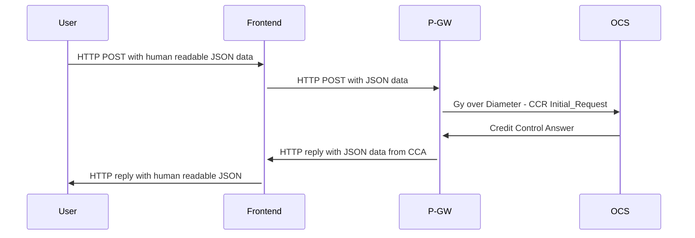
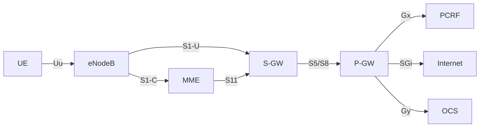

# telehack-2023-case06
Исходные данные для кейса №6 Всероссийского хакатона связи 2023

Командой docker-compose up создается сеть и поднимается эмулятор OCS (Online Charging System), который ожидает подключения на адресе 198.19.0.254, а так же пытается установить соединение с эмулятором PGW c адресом 198.19.0.200 который вам и предстоит сделать.

Конечно, если вы сможете использовать какой либо Diameter Stack на своем любимом языке программирования, это будет супер, но вполне достаточно воспользоваться kamailio и модулями  "ims_diameter_server" и "xhttp".

Модуль "xhttp" позволяет принимать HTTP запросы, а  "ims_diameter_server" позволяет из JSON объекта сделать Diameter пакет и отправить его по сети, а так же получив ответ, превратить его в JSON объект, что позволит отправить его обратно в ответе на HTTP запрос.

Моделируется запрос к OCS оператора с MCC 999 и MNC 99, при запросе с номером абонента 79001234567 - будет выдана квота на минуту, с номером 79001234568 - другая квота, на остальные номера - будет выдаваться код ошибки.

Kamailio вернет JSON с кодами AVP, эмулятор же должен эти коды преобразовать в Human readable строки, что бы полученный результат можно было лего прочитать, так же как в wireshark. Например вместо  ```{ "avpCode": 450, "vendorId": 0, "Flags": M, "int32": 0 }```  выдавать: ```{ avp: "Subscription-Id-Type: 0 (END_USER_E164)" }```

### Call flow



### Просмотр результатов

C помощью команды curl на Frontend отправляем примерно такой запрос:
```
{
    MSISDN: 79001234568
    IMSI: 999990100000001
} 
```

### Отладка
Следующей командой можно записать обмен пакетами между OCS и PGW
```
docker run --rm --net=container:ocs1 -v $PWD:/tcpdump kaazing/tcpdump -n -s 0 -vvvv
```

### Архитектура EPC (Evolved Packet Core)
